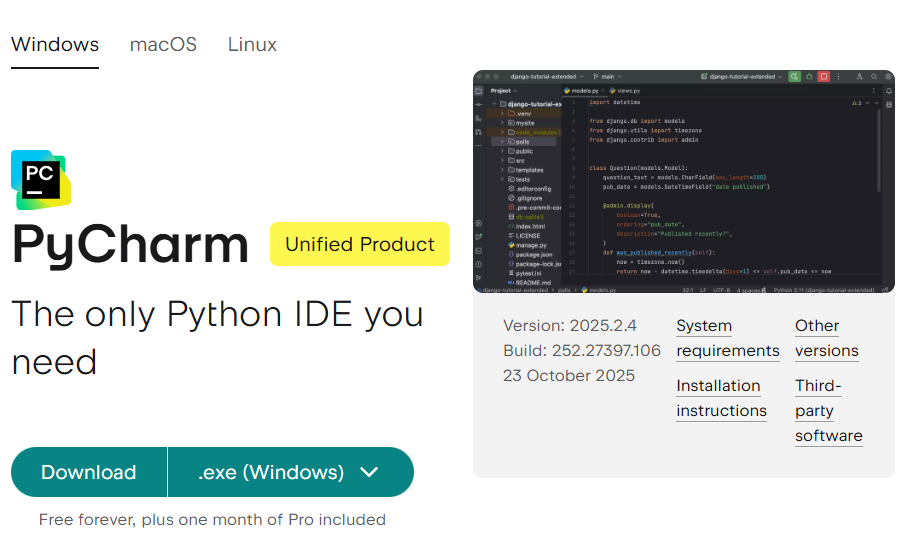
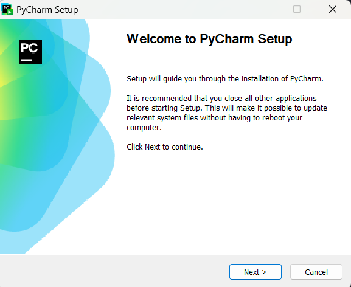
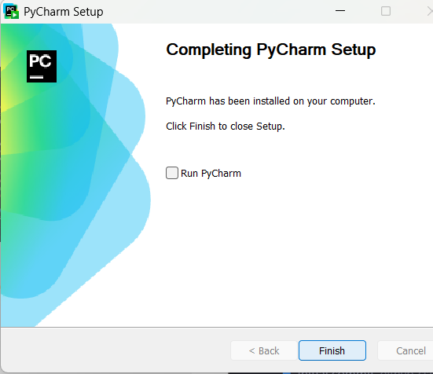
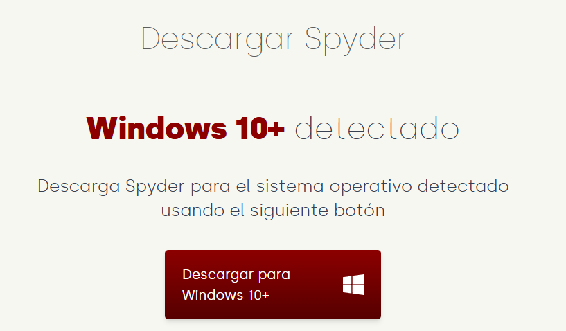
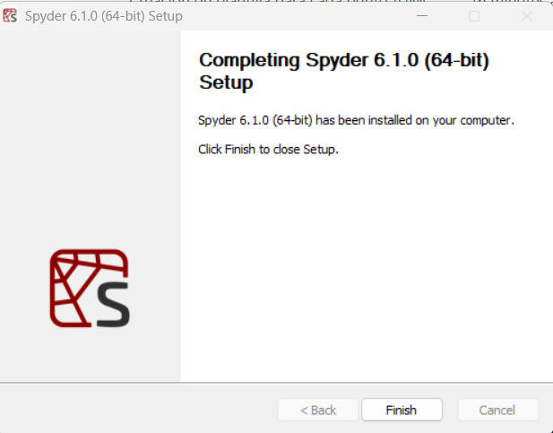

# Punto 1: Instalación de entornos de desarrollo, propietarios y libres.

## IDEs utilizados.
- **IDE 1:** Pycharm (falta versión)
- **IDE 2:** Spyder IDE 6.1.0

## Descripción de la tarea.
Elegir 2 entornos de desarrollo, instalar ambos en el equipo y hacer capturas de pantallas del proceso de instalación.

## Respuestas a preguntas evaluativas.
### Pregunta 1: ¿Qué diferencias encontraste en el proceso de instalación entre el IDE propietario y el libre?
La unica diferencia que he podido encontrar, es que al abrir ambos por primera vez, Pycharm me dejaba escoger si me quería traer las configuraciones de otros IDE que ya tenía instalados y Spyder no me lo pedía, por lo demás la instalación ha sido bastante parecida.

### Pregunta 2: ¿Qué ventajas identificaste en cada uno de los entornos durante la instalación?
Pues lo dicho antes, que Pycharm me deja traerme las configuraciones de otros IDE, como Visual Studio o WebStorm, y en cambio Spyder tiene una configuración por defecto y no es algo que te puedas traer de otro IDE.

## Evidencias.
### Pycharm
- Seleccionamos en google el ejecutable para la instalacion

- Una vez instalado, el ejecutable, lo abrimos para hacer la instalación

### Spyder IDE
- Para este hacemos lo mismo, seleccionamos el ejecutable para la instalación

- Y una vez instalado el ejecutable, comenzamos a instalarlo en el dispositivo

