# Punto 1: Instalación de entornos de desarrollo, propietarios y libres (CE 2.a)
## IDEs utilizados
- **IDE 1:** PyCharm2.4
- **IDE 2:** Thonny4.1.7

## Descripción de la tarea
En este apartado he instalado ambos IDEs paso a paso, observando las diferencias entre ambos y comparandolos.

# Respuestas a preguntas evaluativas
### Pregunta 1: ¿Qué diferencias encontraste en el proceso de instalación entre el IDE propietario y el libre?
Durante la instalación podemos encontrar claramente diferencias entre el IDE propietario (**PyCharm**) y el libre (**Thonny**).

**PyCharm:**
He tenido que acceder a una cuenta de JetBrains y hacer uso de mi licencia educativa para poder instalarlo de forma gratuita. Requiere aceptar la licencia y configurar opciones como accesos directos, asociación de archivos ".py" y componentes extra. Además, tarda más en instalarse y ocupa más espacio en disco

**Thonny:**
Solo he tenido que buscar su página oficial y descargar desde allí el archivo ".exe", no ha requerido ningún registro ni cuenta. Incluye su propio inntérprete de Python y ocupa poco espacio, se instala en pocos segundos. Aunque también hay que aceptar una licencia, no necesita apenas de configuración.

**Resumen:** PyCharm requiere más pasos y configuración debido a su carácter propietario, mientras que Thonny destaca por su simplicidad y su rapidez.

### Pregunta 2: ¿Qué ventajas identificaste en cada uno de los entornos durante la instalación?
**PyCharm:**
Permite personalizar aspectos del entorno de desarrollo, como los accesos directos, la asociación de archivos y la configuración de intérpretes. Además al tener cuenta educativa se desbloquean funciones avanzadas (bases de datos, depuración rofesional, herramientas para proyectos grandes...).

**Thonny:**
La instalación es muy rápida y sin complicaciones, ya que no requiere registro ni licencia y ocupa menos espacio. Como el software es libre, no tiene restricciones de uso.

## Imagenes del proceso de instalación:
### Instalación PyCharm
- Abrimos Jetbrains con nuestra licencia de estudiante

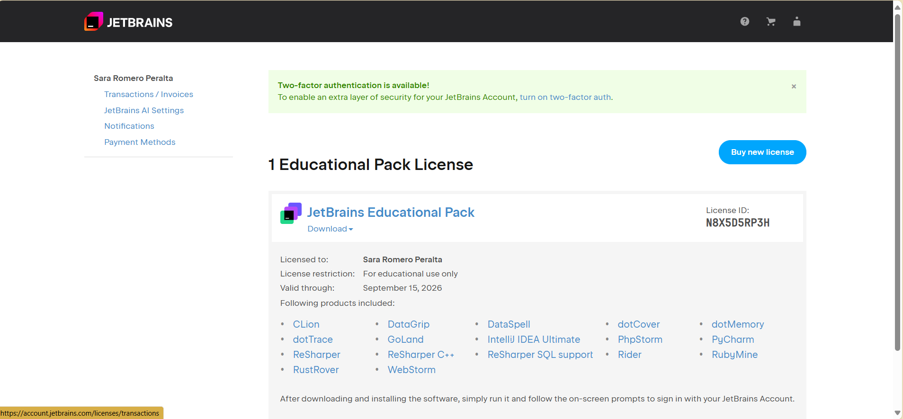

- En el apartado de Download buscamos PyCharm

- Descargamos la version de 989.05MB

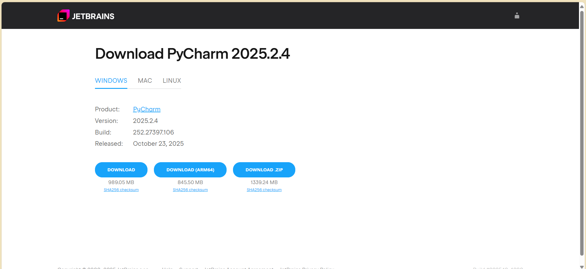

- Esperamos a que se termine de instalar el archivo ".exe"

- Abrimos el archivo y configuramos las opciones

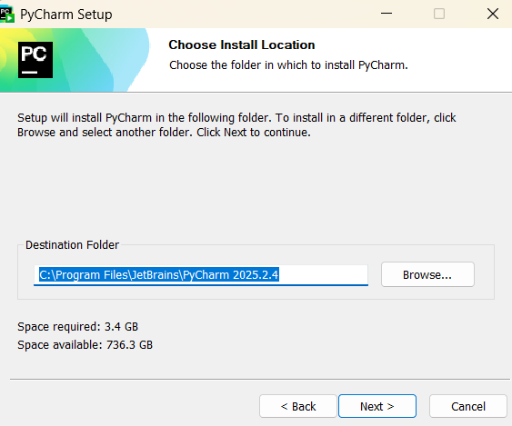
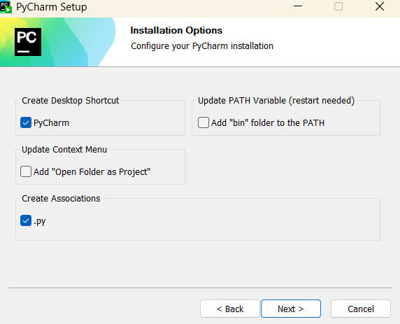
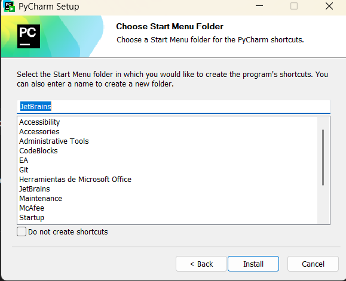

- Una vez configurado, se abrirá el programa

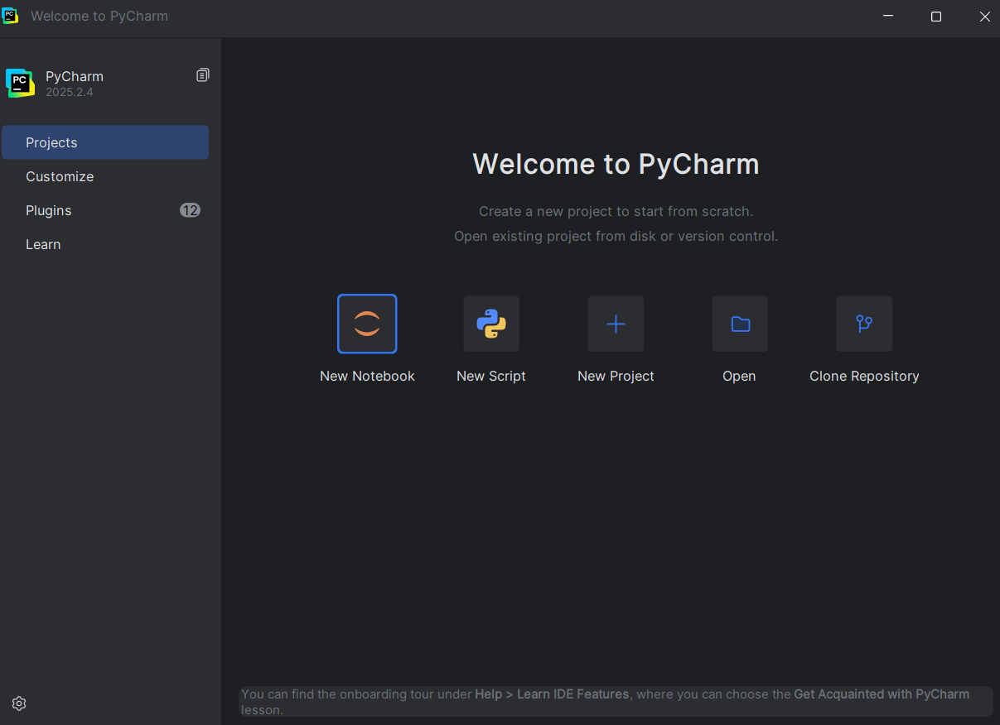

### Instalacion Thonny
- Abrimos la página de Thonny

- Nos diriguimos al apartado de Downloads

- Elegimos el enlace correspondiente con nuestro dispositivo

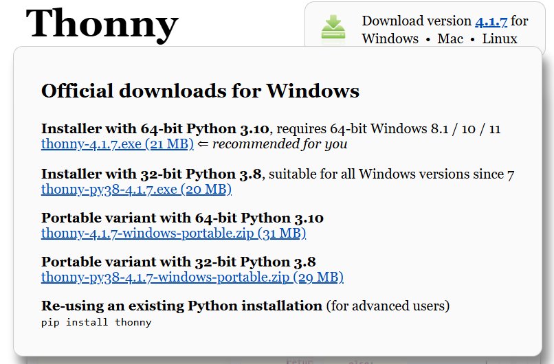

- Esperamos a que se complete la descarga

- Iniciamos el programa y esperamos a que se descarguen los datos

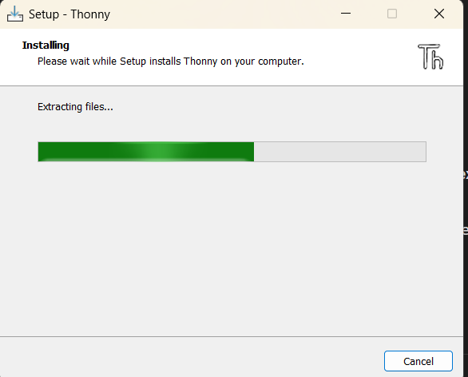

- Seleccionamos el idioma y finalizamos la descarga

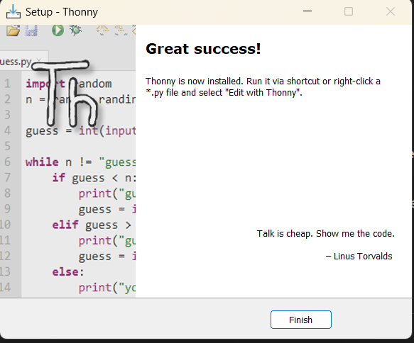
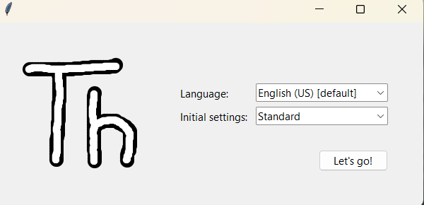

- Abrimos de nuevo el programa

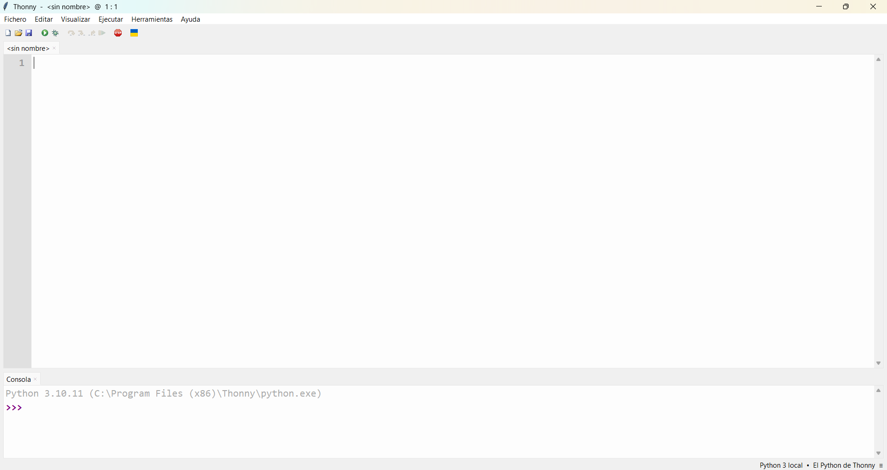