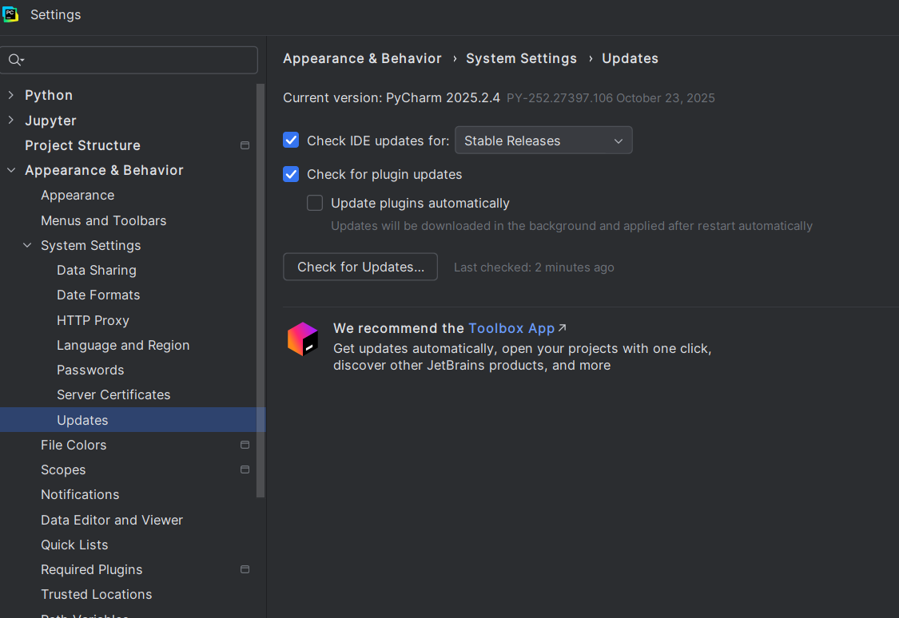
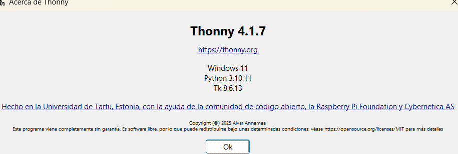

# Punto 4 Configuración del sistema de actualización del entorno de desarrollo (CE 2.d)

## IDEs utilizados:
- **IDE 1:** PyCharm2.4
- **IDE 2:** Thonny4.1.7

## Descripción de la tarea
Configurar el sistema dde actualizaciones automáticas o manuales en ambos IDEs para asegurar que están al día con las últimas versiones y mejoras

# Respuestas a preguntas evaluativas
### 1. ¿Cómo configuraste las actualizaciones automáticas en cada IDE?
**PyCharm:**
Configuré el sistema de actualizaciones automáticas desde el menú File -> Settings -> Appearance & Behavior -> System Settings -> Updates.
Allí seleccioné la opción para que el programa compruebe e instale actualizaciones automáticamente, lo que permite que siempre se mantenga al día con las últimas versiones sin intervención manual.

**Thonny:**
Este IDE no cuenta con un sistema automático de actualización, por lo que configuré el proceso de manera manual.
Para ello, revisé la versión instalada desde Ayuda -> Acerca de Thonny y la comparé con la disponible en la página oficial https://thonny.org.
Cuando existe una versión más reciente, descargo e instalo el paquete actualizado.

### 2. ¿Por qué es importante mantener el IDE actualizado en proyectos de desarrollo?
Mentener el IDE actualizado es fundamental porque las nuevas versiones corrigen errores, mejoran el rendimiento y añaden compatibilidad con versiones recientes de Python o librerías externas.
Además, las actualizaciones suelen incluir mejoras en la seguridad y nuevas.

## Imagenes del proceso:
### Proceso en PyCharm:

- Vamos a Settings -> Updates y seleccionamos todas las opciones que haya

### Proceso en Thonny:
- Como thonny no permite activar actualización automática, simplemente observamos su versión y comprobamos que sea la más nueva

